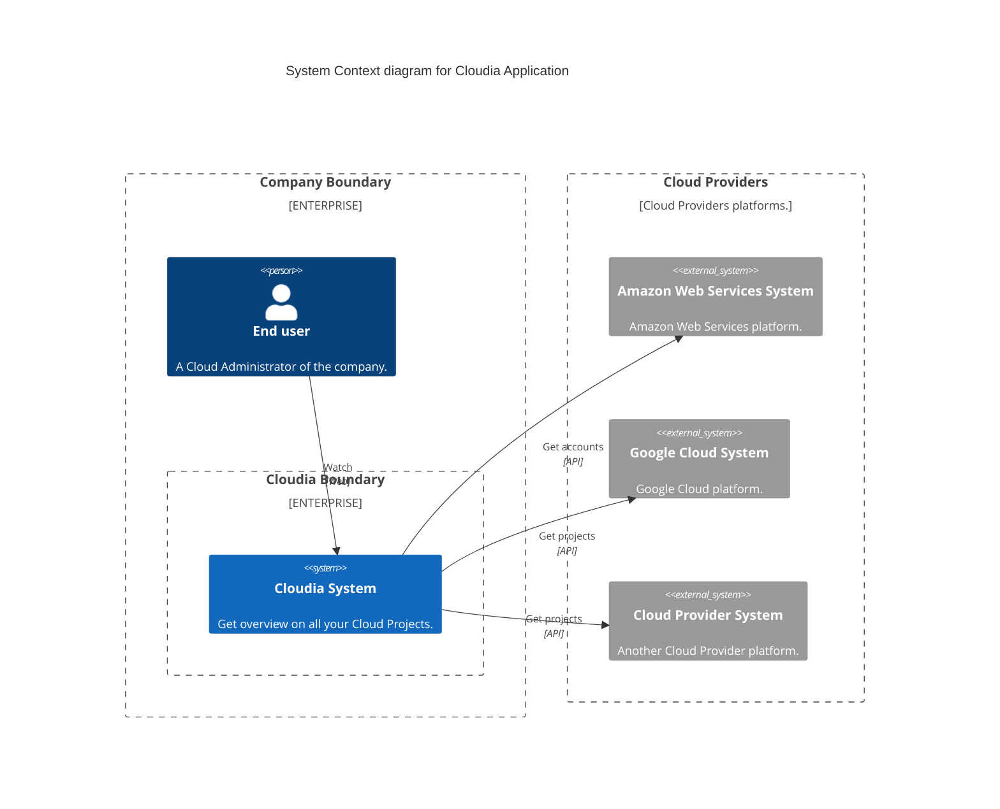
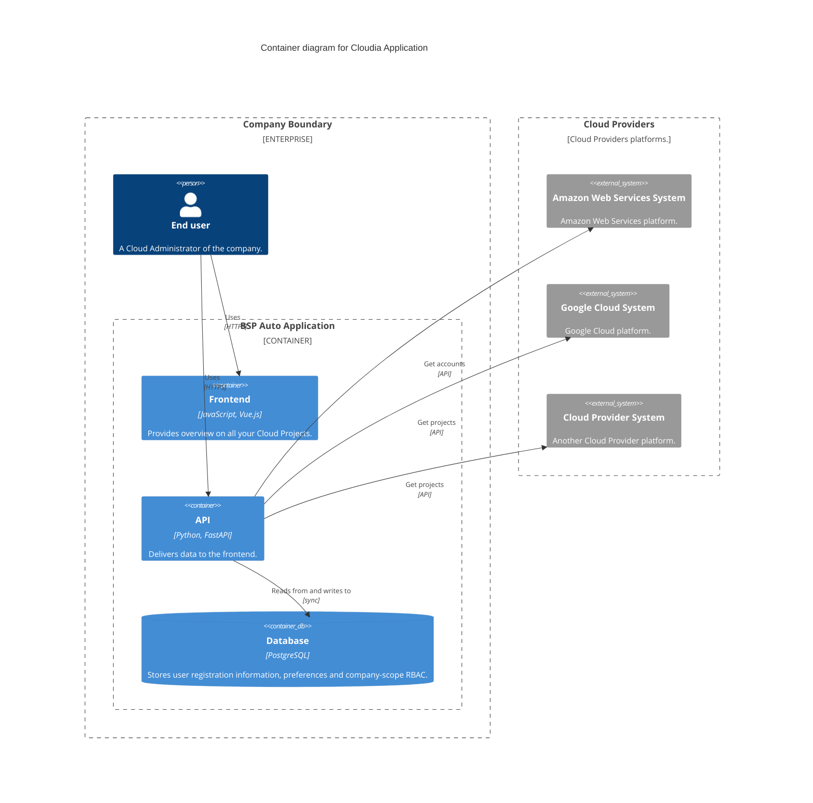

# C4 Model

## System Cloudia Application

```mermaid
C4Context
    title System Context diagram for Cloudia Application

    Enterprise_Boundary(company_boundary, "Company Boundary", "Company") {
        Person(customer, "End user", "A Cloud Administrator of the company.")
        
        Enterprise_Boundary(claudia_boundary, "Cloudia Boundary", "Cloudia Application.") {
            System(cloudia_system, "Cloudia System", "Get overview on all your Cloud Projects.")
        }
    }

    Boundary(cloud_provider, "Cloud Providers", "Cloud Providers platforms."){
        System_Ext(aws_system, "Amazon Web Services System", "Amazon Web Services platform.")
        System_Ext(gcp_system, "Google Cloud System", "Google Cloud platform.")
        System_Ext(cloud_system, "Cloud Provider System", "Another Cloud Provider platform.")
    }

    Rel(customer, cloudia_system, "Watch", "Web")
    Rel(cloudia_system, aws_system, "Get accounts", "API")
    Rel(cloudia_system, gcp_system, "Get projects", "API")
    Rel(cloudia_system, cloud_system, "Get projects", "API")

    UpdateLayoutConfig($c4ShapeInRow="1", $c4BoundaryInRow="2")
```

## Container Cloudia Application

```mermaid
C4Context
    title Container diagram for Cloudia Application

    Enterprise_Boundary(company_boundary, "Company Boundary", "Company") {

        Person(customer, "End user", "A Cloud Administrator of the company.")

        Container_Boundary(bspauto_boundary, "BSP Auto Application") {
            Container(app_front, "Frontend", "JavaScript, Vue.js", "Provides overview on all your Cloud Projects.")
            Container(app_api, "API", "Python, FastAPI", "Delivers data to the frontend.")
            ContainerDb(database, "Database", "PostgreSQL", "Stores user registration information, preferences and company-scope RBAC.")
        }
    }

    Boundary(cloud_provider, "Cloud Providers", "Cloud Providers platforms."){
        System_Ext(aws_system, "Amazon Web Services System", "Amazon Web Services platform.")
        System_Ext(gcp_system, "Google Cloud System", "Google Cloud platform.")
        System_Ext(cloud_system, "Cloud Provider System", "Another Cloud Provider platform.")
    }


    Rel(customer, app_front, "Uses", "HTTPS")
    Rel(customer, app_api, "Uses", "HTTPS")
    Rel_Back(database, app_api, "Reads from and writes to", "sync")
    Rel(app_api, aws_system, "Get accounts", "API")
    Rel(app_api, gcp_system, "Get projects", "API")
    Rel(app_api, cloud_system, "Get projects", "API")

    UpdateLayoutConfig($c4ShapeInRow="2", $c4BoundaryInRow="2")
```